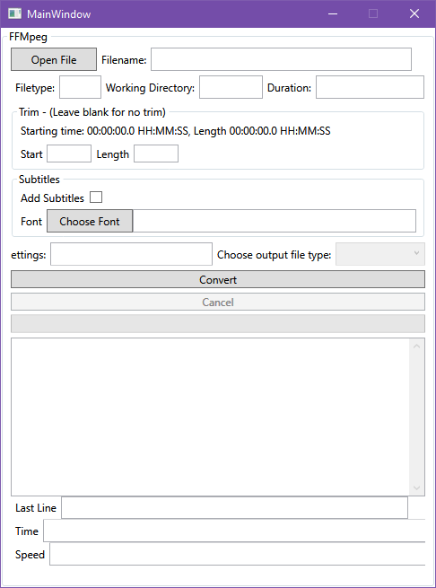

# FFMpegTool

GUI for FFMPEG using C#/WPF.

## Description

This tool is a GUI frontend for FFMPEG to make it easier to choose files and burn subtitles into the video.

Shows estimated time remaining for conversion.

Download from the [Releases](https://github.com/keeganatorr/FFMpegTool/releases) tab above.

### Running Prerequisites

This software requires FFMPEG installed and linked in your PATH environment variable.

A simple way to do this is:

Install [Chocolately](https://chocolatey.org/).

Open the command line `cmd.exe`.

Run `choco install ffmpeg`.

### Build Prerequisites

Visual Studio 2019 - (An earlier version might work.)

### Screenshots

### To Do

- [ ] Add cutting out sections of video.
- [ ] External subtitles.
- [ ] Resize/Cropping.
- [ ] Add comments to code.
- [ ] List functionality and code snippets available

### Contains

- Launching external console process and capturing output to textbox.
- Sending CTRL-C command to external process.
- Font Picker (external library).

### Authors

keeganatorr

### Acknowledgments

Stack Overflow: [Code found at thread](https://stackoverflow.com/questions/283128/how-do-i-send-ctrlc-to-a-process-in-c)

FFMPEG Developers

[Wpf Color Font Dialog](https://github.com/sskodje/WpfColorFont)